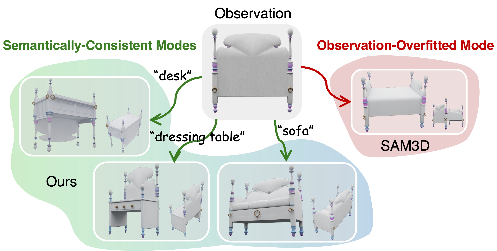
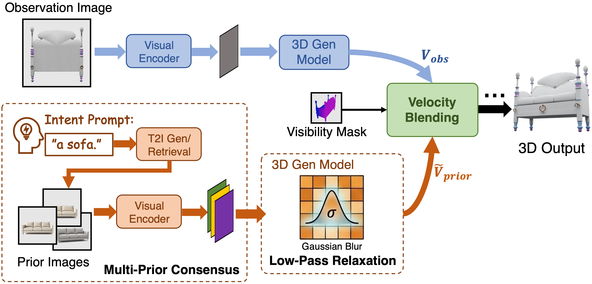
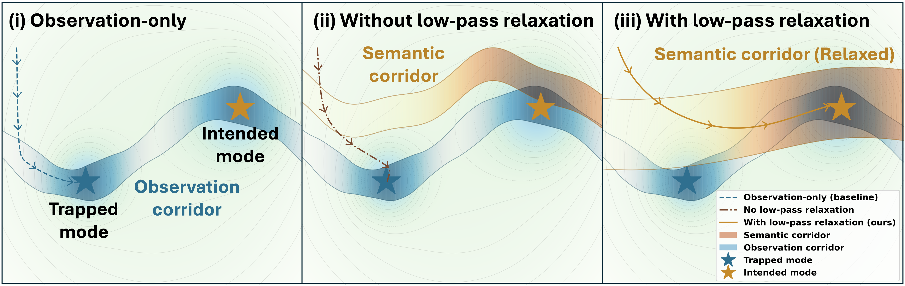

<div align="center">
   <h1 align="center">RelaxFlow: Text-Driven Amodal 3D Generation
   </h1>

   <p>
      <a href="https://arxiv.org/abs/2603.05425" target="_blank"></a>
      <a href="https://jyzhu.top/RelaxFlow_Webpage/" target="_blank"></a>
      <br>
      <a href="https://huggingface.co/datasets/KayZhu/ExtremeOcc-3D" target="_blank"></a>
      <a href="https://huggingface.co/datasets/KayZhu/AmbiSem-3D" target="_blank"></a>
      <br>
      <!-- 
       -->
   </p>
</div>

<p align="center">
  <a href="https://jyzhu.top/" target="_blank">Jiayin Zhu</a><sup>1</sup>,&nbsp;</a>
  <a href="https://scholar.google.com/citations?user=a8CLpC0AAAAJ&hl=en" target="_blank">Guoji Fu</a><sup>1</sup>,&nbsp;</a>
  <a href="https://github.com/xiaolul2" target="_blank">Xiaolu Liu</a><sup>2 1</sup>,&nbsp;</a>
  <a href="https://qy-h00.github.io/" target="_blank">Qiyuan He</a><sup>1</sup>,&nbsp;</a>
  <a href="https://yl3800.github.io/" target="_blank">Yicong Li</a><sup>3</sup>,&nbsp;</a>
  <a href="https://www.comp.nus.edu.sg/~ayao/" target="_blank">Angela Yao</a><sup>1</sup>;</a>
  <br>
  National University of Singapore <sup>1</sup>
  <br/>
  Zhejiang University <sup>2</sup>
  <br/>
  University of Science and Technology of China <sup>3</sup>
</p>

<!-- <h3 align="center">Arxiv 2026</h3> -->

## 🎯 What We Do: Resolving Semantic Ambiguity

<p align="center"></p>

Image-to-3D generation faces inherent semantic ambiguity under occlusion, where partial observation alone is often insufficient to determine the object category. For instance, a visible wooden backboard could plausibly correspond to a sofa, a bed, or a dressing table. Existing feedforward models, like SAM3D, often collapse to an "observation-overfitted" shape by uncontrolled hallucination.

We formalize **text-driven amodal 3D generation**. Our task allows users to *explicitly steer the completion of unseen regions using text prompts*, while strictly preserving the visual evidence of the input observation.

## ⚙️ How We Do It: Decoupled Control & Relaxation

<p align="center"></p>

These dual objectives demand distinct control granularities: rigid control for the visible observation versus relaxed structural control for the text prompt. To solve this, we propose **RelaxFlow**, a training-free dual-branch framework:

- **Observation Branch**: Provides strict adherence to ensure visual fidelity for the observed pixels.
- **Multi-Prior Consensus**: Converts the text prompt into visual proxy reference images. Cross-attention across these priors naturally amplifies structural consensus while suppressing inconsistent, instance-specific textures.
- **Visibility-Aware Fusion**: A spatial blending mechanism ensuring the semantic guide only steers genuinely occluded regions, while the observation strictly governs the visible pixels.

### The Theory: Low-Pass Relaxation

<p align="center"></p>

A core challenge is preventing the text prompt's high-frequency details from clashing with the input image. We introduce a **Relaxation Mechanism** that smooths cross-attention logits within the generation backbone.

Theoretically, we prove this smoothing is equivalent to applying a low-pass filter on the generative vector field. This mathematically suppresses high-frequency instance details and exposes a "coarse semantic corridor," enforcing only the low-frequency global geometry needed to accommodate the observation (e.g., the general shape of a "sofa").

## 📊 Benchmarks & Results

To facilitate systematic evaluation, we introduce two benchmark datasets:

- **[ExtremeOcc-3D](https://huggingface.co/datasets/KayZhu/ExtremeOcc-3D)**: 264 natural indoor scenes with severe occlusion, where visible evidence alone cannot identify the object category.
- **[AmbiSem-3D](https://huggingface.co/datasets/KayZhu/AmbiSem-3D)**: semantic-ambiguity cases where the same visible evidence admits multiple plausible text-conditioned completions. The Hugging Face dataset contains the hand-curated **AmbiSem-3D** split under `original/` and the larger **AmbiSem-3D-Ext** split under `extended/`.

### Results 

<p align="center"></p>

Extensive experiments demonstrate that RelaxFlow successfully steers the generation of unseen regions to match the prompt intent. It avoids the observation-overfitted collapse of existing models and produces high-quality 3D assets without compromising visual fidelity.

## 🚀 Get Started

### Installation

Follow the [setup](https://github.com/facebookresearch/sam-3d-objects/blob/afdf6a31522d038c44c68a0bb57aa68827380797/doc/setup.md) steps of SAM 3D Objects before running the following.
Based on our testing, the minimum requirement is a single GPU with 24GB of memory (e.g., NVIDIA RTX A5000).
Install the RelaxFlow Python dependencies from this repository; this includes `huggingface-hub` for downloading the released benchmark manifests and assets.

```sh
python -m pip install -r requirements.txt
```

## Quickstart

For a quick start, run `python demo_relaxflow.py` using test data:

```sh
FOLDER="test_data/A_bike_with_a_blue_front_wheel_and_a_red_rear_wheel"
OUTNAME=$(basename $FOLDER)
IMG=${FOLDER}/image.png
MSK=${FOLDER}/mask.png
# PRI="${FOLDER}/prior1.png ${FOLDER}/prior2.png ${FOLDER}/prior3.png ${FOLDER}/prior4.png"
PRI=${FOLDER}/prior.png
python demo_relaxflow.py --image $IMG --mask $MSK --prior-images $PRI --output-name $OUTNAME 
```

Another case:

```sh
FOLDER="test_data/dressing_table"
OUTNAME=$(basename $FOLDER)
IMG=${FOLDER}/input.png
PRI="${FOLDER}/prior1.png ${FOLDER}/prior2.png ${FOLDER}/prior3.png"
python demo_relaxflow.py --image $IMG --prior-images $PRI --output-name $OUTNAME 
```

Results will be saved into `outputs/`.

### Benchmarks

The benchmark releases are file-based Hugging Face datasets. Download them with `huggingface_hub.snapshot_download` so that the manifest-relative paths are preserved locally:

```sh
mkdir -p data
python - <<'PY'
from huggingface_hub import snapshot_download

snapshot_download(
    repo_id="KayZhu/ExtremeOcc-3D",
    repo_type="dataset",
    local_dir="data/ExtremeOcc-3D",
)
snapshot_download(
    repo_id="KayZhu/AmbiSem-3D",
    repo_type="dataset",
    local_dir="data/AmbiSem-3D",
)
PY
```

After download, the manifests used by the batch runner are:

- `data/ExtremeOcc-3D/manifest.json`
- `data/AmbiSem-3D/original/manifest.json`
- `data/AmbiSem-3D/extended/manifest.json`

The released manifests include each observation and its `prior_text`. To run RelaxFlow with text-conditioned priors, generate one or more prior images for each sample from `prior_text`, then save them under a folder named by the sample `id`:

```text
data/ExtremeOcc-3D/priors/<sample_id>/prior_0.png
data/AmbiSem-3D/original/priors/<sample_id>/prior_0.png
data/AmbiSem-3D/extended/priors/<sample_id>/prior_0.png
```

For ExtremeOcc-3D, sample IDs contain slashes; keep the same nested path under `priors/`. Then attach the generated priors to the manifests:

```sh
python scripts/prepare_manifest_with_priors.py \
  --manifest data/.../manifest.json \
  --priors-root data/.../priors \
  --output data/.../manifest_with_priors.json
```

Run the batch benchmark script with the prepared manifests. Remove `--max-samples` for a full evaluation.

```sh
python demo_relaxflow_batch.py \
  --dataset data/.../manifest_with_priors.json \
  --data-root data/... \
  --output-name output_relaxflow \
  --max-samples 4
```

## License

This repository is built upon the SAM 3D Objects model as a backbone; both the original SAM 3D Objects code and the modifications in this repository are licensed under the [SAM License](./LICENSE).

## Citing RelaxFlow

If you find our work useful, please use the following BibTeX entry.

```bibtex
@inproceedings{zhu2026relaxflow,
  title     = {RelaxFlow: Text-Driven Amodal 3D Generation},
  author    = {Zhu, Jiayin and Fu, Guoji and Liu, Xiaolu and He, Qiyuan and Li, Yicong and Yao, Angela},
  booktitle = {Proceedings of the 43rd International Conference on Machine Learning},
  year      = {2026},
  url       = {https://arxiv.org/abs/2603.05425}
}
```
